<div align="center">

# Multi-Cloud DB Manager

### One console for every database, across every cloud.

A web-based PostgreSQL and Redis management tool for querying multiple database instances across cloud providers **simultaneously** — with role-based access, full audit trails, and release verification built in.

<br />



<br />

[**Quick Start**](#-quick-start) · [**Features**](#-features) · [**Architecture**](#-architecture) · [**API**](#-api-reference) · [**Deploy**](#-docker) · [**Config Guide**](backend/CONFIG.md)

<br />

[](LICENSE)
[](https://nodejs.org)
[](https://www.postgresql.org)
[](https://redis.io)
[](https://www.typescriptlang.org)
[](https://react.dev)

</div>

<br />

---

## ◆ Why this exists

Managing PostgreSQL across AWS, GCP, or any cloud means juggling connections, credentials, and comparing results manually. This tool gives you **one UI to query them all** — run the same SQL on every cloud at once, compare results side‑by‑side, and maintain a full audit trail with role‑based access control.

<table>
  <tr>
    <td width="25%" valign="top">
      <h4>Compare replicas</h4>
      <sub>Run the same query on AWS and GCP simultaneously. Catch divergence after migrations.</sub>
    </td>
    <td width="25%" valign="top">
      <h4>Health check fleets</h4>
      <sub>One query, every instance, side‑by‑side results with timing per cloud.</sub>
    </td>
    <td width="25%" valign="top">
      <h4>Ship schema changes</h4>
      <sub>Execute DDL across environments in one shot, with rollback on failure.</sub>
    </td>
    <td width="25%" valign="top">
      <h4>Audit everything</h4>
      <sub>Complete execution log with role‑based permissions and password‑protected destructive ops.</sub>
    </td>
  </tr>
</table>

<br />

---

## ◈ Features

### Core

```
┌────────────────────────────────────┬──────────────────────────────────────────────────────────┐
│ Multi‑cloud execution              │ Query all clouds simultaneously or target a specific one │
│ Dynamic configuration              │ Add clouds and databases via JSON — zero code changes    │
│ Async query engine                 │ Non‑blocking execution with progress + cancellation      │
│ Multi‑statement support            │ Batches separated by ';' with per‑statement results      │
│ Role‑based access                  │ MASTER / USER / READER with granular SQL control         │
│ Password‑protected ops             │ DROP, TRUNCATE, DELETE, ALTER require MASTER password    │
│ Query history & audit              │ Full execution log with filtering and pagination         │
│ Env variable substitution          │ ${VAR_NAME} in config for secure credential management   │
└────────────────────────────────────┴──────────────────────────────────────────────────────────┘
```

<br />

### SQL Editor

| | |
|---|---|
| **Monaco Editor** | VS Code's editor engine with PostgreSQL syntax highlighting |
| **SQL formatting** | One‑click format, PostgreSQL dialect, uppercase keywords |
| **Auto‑save** | Drafts saved every 5 seconds to localStorage with restore on reload |
| **Keyboard shortcuts** | `⌘/Ctrl + Enter` to execute |
| **Dark theme** | Full dark mode UI |

### Results Panel

| | |
|---|---|
| **Side‑by‑side cloud results** | Color‑coded expandable sections per cloud |
| **Table and JSON views** | Toggle between formatted table and raw JSON |
| **CSV / JSON export** | Download results per cloud |
| **Per‑statement breakdown** | Individual results for each statement in a batch |
| **Execution timing** | Duration in milliseconds per cloud |

### Redis Manager

| | |
|---|---|
| **Multi‑cloud Redis** | Execute commands across all configured Redis instances simultaneously |
| **50+ commands** | String, Hash, List, Set, Sorted Set, Stream, Geo, and utility commands |
| **Pattern SCAN** | Find keys matching patterns with preview, pagination, and bulk delete |
| **Command validation** | Syntax checking and dangerous command blocking |
| **Write history** | Full audit trail of all Redis write operations |

### Migration Verifier

| | |
|---|---|
| **Git diff analysis** | Extract SQL migration files between any two commits, tags, or branches |
| **Auto‑verification** | Verify each DDL against read‑only replicas (CREATE/ALTER TABLE, indexes, constraints, NOT NULL, DEFAULT, TYPE) |
| **Multi‑database support** | Separate verification per database (BPP, BAP, dashboards, etc.) |
| **Smart categorization** | Group into ALTER (schema), ALTER NOT NULL, INSERT, UPDATE sections |
| **Copy at every level** | Copy pending SQL per database, folder, file, or category |
| **Run on DB Manager** | Send selected queries directly to the DB Manager for execution |
| **Export checklist** | Generate Markdown or Slack‑formatted release checklists |
| **Read‑only safety** | Triple protection: read replica host + read‑only user + pool‑level `default_transaction_read_only=on` |
| **Auto repo sync** | Init container clones repo; `git fetch` on page load with 5‑min cooldown |

### User Management <sub>— MASTER only</sub>

| | |
|---|---|
| **User registration** | Self‑service signup, requires MASTER activation |
| **Activate / deactivate** | Enable or disable user accounts |
| **Role assignment** | Promote or demote between MASTER / USER / READER |
| **User search** | Search by username, name, or email |
| **User deletion** | Remove accounts (cannot delete MASTER users) |

<br />

---

## ◈ Role permissions

<table>
<thead>
<tr>
  <th align="left">Operation</th>
  <th align="center">MASTER</th>
  <th align="center">USER</th>
  <th align="center">READER</th>
</tr>
</thead>
<tbody>
<tr><td>SELECT</td><td align="center">✓</td><td align="center">✓</td><td align="center">✓</td></tr>
<tr><td>INSERT / UPDATE</td><td align="center">✓</td><td align="center">✓</td><td align="center">—</td></tr>
<tr><td>CREATE TABLE / INDEX</td><td align="center">✓</td><td align="center">✓</td><td align="center">—</td></tr>
<tr><td>ALTER TABLE (ADD)</td><td align="center">✓</td><td align="center">✓</td><td align="center">—</td></tr>
<tr><td>DELETE</td><td align="center">✓ <sub>password</sub></td><td align="center">—</td><td align="center">—</td></tr>
<tr><td>DROP / TRUNCATE</td><td align="center">✓ <sub>password</sub></td><td align="center">—</td><td align="center">—</td></tr>
<tr><td>ALTER DROP</td><td align="center">✓ <sub>password</sub></td><td align="center">—</td><td align="center">—</td></tr>
<tr><td>GRANT / REVOKE</td><td align="center">✓ <sub>password</sub></td><td align="center">—</td><td align="center">—</td></tr>
<tr><td>Redis READ commands</td><td align="center">✓</td><td align="center">✓</td><td align="center">✓</td></tr>
<tr><td>Redis WRITE commands</td><td align="center">✓</td><td align="center">✓</td><td align="center">—</td></tr>
<tr><td>Redis SCAN / KEYS</td><td align="center">✓</td><td align="center">✓</td><td align="center">—</td></tr>
<tr><td>User management</td><td align="center">✓</td><td align="center">—</td><td align="center">—</td></tr>
<tr><td>Cancel any user's query</td><td align="center">✓</td><td align="center">—</td><td align="center">—</td></tr>
</tbody>
</table>

> ⚠ **Blocked for all roles** (including MASTER)
> SQL → `DROP/CREATE DATABASE`, `DROP/CREATE SCHEMA`, `ALTER/CREATE/DROP ROLE`, `ALTER/CREATE/DROP USER`
> Redis → `FLUSHDB`, `FLUSHALL`, `KEYS`, `EVAL`, `EVALSHA`, `SCRIPT DEBUG`, `CLIENT KILL`, `SHUTDOWN`, `BGSAVE`, `BGREWRITEAOF`, `CONFIG RESETSTAT`, `LASTSAVE`

<br />

---

## ◆ Architecture

```
         ┌─────────────────────────────────┐
         │           Frontend              │   React 18 · TypeScript · Material‑UI
         │         Nginx · :80             │   Monaco Editor · Zustand
         └────────────────┬────────────────┘
                          │  REST
                          ▼
         ┌─────────────────────────────────┐
         │           Backend               │   Express · TypeScript
         │          Node · :3000           │   Winston logging · Zod validation
         └───┬─────────────────┬───────────┘
             │                 │
             ▼                 ▼
       ┌──────────┐   ┌─────────────────────────────────┐
       │  Redis   │   │       PostgreSQL Instances      │
       │          │   │   Cloud 1 ── DB1, DB2, ...     │
       │          │   │   Cloud 2 ── DB1, DB2, ...     │
       │          │   │   Cloud N ── ...                │
       └──────────┘   └─────────────────────────────────┘
```

### Stack

| Layer | Technology |
|---|---|
| **Frontend** | React 18 · TypeScript · Material‑UI · Monaco Editor · Zustand · Axios · Vite |
| **Backend** | Node.js · Express · TypeScript · node‑postgres · Zod · Winston · Helmet |
| **Data** | PostgreSQL 12+ · Redis 6+ <sub>(sessions + execution state)</sub> |
| **Deployment** | Docker <sub>(multi‑stage)</sub> · Kubernetes · Nginx |

### Design decisions

- **Redis** stores user sessions (shared across backend replicas) and async query execution state
- **Backend is stateless** — horizontally scalable behind a load balancer
- **Frontend** is an Nginx‑served SPA with runtime backend URL injection (no rebuild per environment)
- **Connection pooling** — 2–20 connections per database, 30s idle timeout, 10s connect timeout
- **Sessions** — HTTP‑only secure cookies, Redis‑backed

<br />

---

## ▶ Quick start

### Requirements

```
Node.js     ≥ 18
PostgreSQL  ≥ 12  (at least one instance to manage)
Redis       ≥ 6
```

### 1 · Clone and install

```bash
git clone https://github.com/vijaygupta18/Multi-Cloud-DB-Manager.git
cd Multi-Cloud-DB-Manager

cd backend  && npm install
cd ../frontend && npm install
```

### 2 · Configure databases

Create `backend/config/databases.json`:

```jsonc
{
  "primary": {
    "cloudName": "cloud1",
    "db_configs": [
      {
        "name": "mydb",
        "label": "My Database",
        "host": "localhost",
        "port": 5432,
        "user": "postgres",
        "password": "password",
        "database": "mydb",
        "schemas": ["public"],
        "defaultSchema": "public"
      }
    ]
  },
  "secondary": [
    {
      "cloudName": "cloud2",
      "db_configs": [
        {
          "name": "mydb",
          "label": "My Database",
          "host": "remote-host",
          "port": 5432,
          "user": "postgres",
          "password": "${CLOUD2_DB_PASSWORD}",
          "database": "mydb",
          "schemas": ["public"],
          "defaultSchema": "public"
        }
      ]
    }
  ],
  "history": {
    "host": "localhost",
    "port": 5432,
    "user": "postgres",
    "password": "password",
    "database": "mydb"
  }
}
```

| Key | Purpose |
|---|---|
| `primary` | Your main cloud. Must have exactly one entry. |
| `secondary` | Additional clouds. Add as many as you need, or leave as `[]`. |
| `history` | Database where users and query audit trail are stored (can reuse an existing database). |
| `readReplicas` <sub>optional</sub> | Read‑only replica endpoints for Migration Verifier. |
| `migrations` <sub>optional</sub> | Git repo path and folder‑to‑database mapping for migration analysis. |

> 💡 Use `${ENV_VAR}` syntax for secrets — values are substituted from `.env` at startup.

### 2b · Configure Redis <sub>(optional)</sub>

Create `backend/config/redis.json`:

```jsonc
{
  "primary": {
    "cloudName": "aws",
    "host": "redis.cluster.amazonaws.com",
    "port": 6379,
    "password": "${REDIS_PASSWORD}"
  },
  "secondary": [
    {
      "cloudName": "gcp",
      "host": "redis.googleapis.com",
      "port": 6379,
      "password": "${GCP_REDIS_PASSWORD}"
    }
  ]
}
```

> See [`backend/CONFIG.md`](backend/CONFIG.md) for the full configuration reference.

### 3 · Set environment variables

**`backend/.env`**
```env
PORT=3000
NODE_ENV=development
REDIS_HOST=localhost
REDIS_PORT=6379
SESSION_SECRET=change-this-to-a-long-random-string
FRONTEND_URL=http://localhost:5173
RUN_MIGRATIONS=true

# Database credential variables referenced in databases.json
CLOUD2_DB_PASSWORD=your-secure-password
```

**`frontend/.env`**
```env
VITE_API_URL=http://localhost:3000
```

### 4 · Start services

```bash
# Terminal 1  ·  Redis
redis-server

# Terminal 2  ·  Backend
cd backend && npm run dev

# Terminal 3  ·  Frontend
cd frontend && npm run dev
```

Open → **http://localhost:5173**

### 5 · Create your first admin

1. Register a new account via the login page
2. Promote yourself to MASTER:

   ```sql
   UPDATE dual_db_manager.users
   SET role = 'MASTER', is_active = true
   WHERE username = 'your-username';
   ```
3. Log out and log back in. You now have full access.

<br />

---

## ◈ Environment variables

| Variable | Default | Description |
|---|---|---|
| `PORT` | `3000` | Backend server port |
| `NODE_ENV` | `development` | `development` or `production` |
| `REDIS_HOST` | `localhost` | Redis hostname |
| `REDIS_PORT` | `6379` | Redis port |
| `REDIS_PASSWORD` | — | Redis password (optional) |
| `REDIS_DB` | `0` | Redis database number |
| `SESSION_SECRET` | — | **Required.** Random string for session encryption |
| `FRONTEND_URL` | `http://localhost:5173` | CORS allowed origin |
| `MAX_QUERY_TIMEOUT_MS` | `300000` | Overall query timeout (5 min) |
| `STATEMENT_TIMEOUT_MS` | `300000` | Per‑statement PostgreSQL timeout (5 min) |
| `REDIS_EXECUTION_TTL_SECONDS` | `300` | Async execution state TTL in Redis (5 min) |
| `RUN_MIGRATIONS` | `false` | Auto‑create `dual_db_manager` schema on startup |

<br />

---

## ◆ Database schema

<sub>Migrations auto‑create (when `RUN_MIGRATIONS=true`) or run manually with `npm run migrate`.</sub>

<details>
<summary><b><code>dual_db_manager.users</code></b></summary>

| Column | Type | Description |
|---|---|---|
| `id` | `UUID` | Primary key |
| `username` | `VARCHAR(255)` | Unique login name |
| `password_hash` | `TEXT` | bcrypt hash |
| `email` | `VARCHAR(255)` | Unique email |
| `name` | `VARCHAR(255)` | Display name |
| `role` | `VARCHAR(50)` | `MASTER`, `USER`, or `READER` |
| `is_active` | `BOOLEAN` | Account enabled (default: `false`) |
| `created_at` | `TIMESTAMP` | Registration time |

</details>

<details>
<summary><b><code>dual_db_manager.query_history</code></b></summary>

| Column | Type | Description |
|---|---|---|
| `id` | `UUID` | Primary key |
| `user_id` | `UUID` | Foreign key to users |
| `query` | `TEXT` | Executed SQL |
| `database_name` | `VARCHAR(50)` | Target database |
| `execution_mode` | `VARCHAR(50)` | `both` or specific cloud name |
| `cloud_results` | `JSONB` | Per‑cloud results with success, duration, rows |
| `created_at` | `TIMESTAMP` | Execution time |

</details>

<br />

---

## ⚓ Docker

Both services use **multi‑stage builds** for minimal image size.

```bash
# Build (use --platform linux/amd64 when deploying to x86 servers from ARM machines)
docker build --platform linux/amd64 -t multi-cloud-db-backend  ./backend
docker build --platform linux/amd64 -t multi-cloud-db-frontend ./frontend

# Run backend
docker run -p 3000:3000 \
  --env-file backend/.env \
  multi-cloud-db-backend

# Run frontend (BACKEND_URL injected at runtime — no rebuild per environment)
docker run -p 80:80 \
  -e BACKEND_URL=http://your-backend:3000 \
  multi-cloud-db-frontend
```

> ✓ **Health checks built in** — Backend `GET /health` · Frontend `GET /`

<br />

---

## ☸ Kubernetes

Manifests in `k8s/`:

| File | Description |
|---|---|
| `backend.yaml` | Backend Deployment (2 replicas) + Service + liveness/readiness probes |
| `frontend.yaml` | Frontend Deployment (2 replicas) + Nginx ConfigMap + Service |
| `secrets.yaml.example` | Template for secrets (copy to `secrets.yaml` and fill in) |

```bash
cp k8s/secrets.yaml.example k8s/secrets.yaml
# Edit secrets.yaml with base64-encoded values
kubectl apply -f k8s/
```

**Deployment defaults**

- Rolling updates — 25% maxSurge, 25% maxUnavailable
- Backend — 200m CPU / 256Mi memory request · 500m / 512Mi limits
- Frontend — 50m CPU / 64Mi memory request · 100m / 128Mi limits
- Session affinity (`ClientIP`) for consistent session routing

<br />

---

## ◈ API reference

<details open>
<summary><b>Authentication</b> — <code>/api/auth</code></summary>

| Method | Endpoint | Auth | Description |
|---|---|---|---|
| `POST` | `/api/auth/register` | — | Register new user (inactive by default) |
| `POST` | `/api/auth/login` | — | Login with username + password |
| `GET` | `/api/auth/me` | User | Get current authenticated user |
| `POST` | `/api/auth/logout` | User | Logout and destroy session |
| `GET` | `/api/auth/users` | Master | List all users |
| `GET` | `/api/auth/users/search?q=term` | Master | Search users by username, name, or email |
| `POST` | `/api/auth/activate` | Master | Activate user accounts |
| `POST` | `/api/auth/deactivate` | Master | Deactivate user accounts |
| `POST` | `/api/auth/change-role` | Master | Change user role (MASTER/USER/READER) |
| `POST` | `/api/auth/delete` | Master | Delete a user account |

</details>

<details>
<summary><b>Query execution</b> — <code>/api/query</code></summary>

| Method | Endpoint | Auth | Description |
|---|---|---|---|
| `POST` | `/api/query/execute` | User | Execute query (async) — returns `executionId` |
| `GET` | `/api/query/status/:id` | User | Poll execution status and results |
| `POST` | `/api/query/cancel/:id` | User | Cancel a running query (own queries, or any as MASTER) |
| `GET` | `/api/query/active` | User | List active executions |
| `POST` | `/api/query/validate` | User | Validate SQL syntax without executing |

</details>

<details>
<summary><b>Redis manager</b> — <code>/api/redis</code></summary>

| Method | Endpoint | Auth | Description |
|---|---|---|---|
| `POST` | `/api/redis/execute` | User | Execute Redis command across clouds |
| `POST` | `/api/redis/validate` | User | Validate Redis command syntax |
| `GET` | `/api/redis/scan` | User | SCAN for keys matching pattern |
| `POST` | `/api/redis/delete-keys` | User | Delete keys matching pattern |
| `GET` | `/api/redis/history` | User | Redis write history with filters |

</details>

<details>
<summary><b>History</b> — <code>/api/history</code></summary>

| Method | Endpoint | Auth | Description |
|---|---|---|---|
| `GET` | `/api/history` | User | Query history with filters (`database`, `user_id`, `success`, `limit`, `offset`) |
| `GET` | `/api/history/:id` | User | Get specific execution details |

</details>

<details>
<summary><b>Schema</b> — <code>/api/schemas</code></summary>

| Method | Endpoint | Auth | Description |
|---|---|---|---|
| `GET` | `/api/schemas/configuration` | User | Full database + cloud configuration |
| `GET` | `/api/schemas/:database?cloud=` | User | Schemas for a specific database |

</details>

<details>
<summary><b>Migration verifier</b> — <code>/api/migrations</code></summary>

| Method | Endpoint | Auth | Description |
|---|---|---|---|
| `GET` | `/api/migrations/config` | User | Available environments, databases, path mappings |
| `GET` | `/api/migrations/refs` | User | Recent git branches and tags for autocomplete |
| `POST` | `/api/migrations/analyze` | User | Analyze SQL diff between two refs against read replica |
| `GET` | `/api/migrations/file?ref=&path=` | User | Raw SQL content of a file at a git ref |
| `POST` | `/api/migrations/refresh-repo` | User | Fetch latest changes from git remote |

</details>

<details>
<summary><b>Health</b> — <code>/health</code></summary>

| Method | Endpoint | Auth | Description |
|---|---|---|---|
| `GET` | `/health` | — | Returns `{ status: "ok", timestamp, uptime }` |

</details>

<br />

---

## ◆ Security

| Layer | Implementation |
|---|---|
| **SQL injection** | Parameterized queries throughout — no string concatenation |
| **Authentication** | Session‑based with HTTP‑only secure cookies <sub>(no JWT tokens to leak)</sub> |
| **Password storage** | bcrypt with 10 salt rounds |
| **Authorization** | Role‑based middleware on every route |
| **Dangerous queries** | Server‑side validation + client‑side warnings + password verification |
| **Session storage** | Redis‑backed, 7‑day expiry, SameSite cookies |
| **HTTP headers** | Helmet <sub>(X‑Frame‑Options, X‑Content‑Type‑Options, X‑XSS‑Protection)</sub> |
| **CORS** | Whitelist configured origins only |
| **Query timeouts** | Configurable per‑statement and overall timeouts |
| **Blocked operations** | DROP/CREATE DATABASE/SCHEMA, ALTER/CREATE/DROP ROLE/USER — blocked for all roles |
| **Migration safety** | Read‑only replicas + `default_transaction_read_only=on` + `execFileSync` (no shell injection) + path validation |

<br />

---

## ◈ Development

### Available scripts

**Backend** <sub>(`cd backend`)</sub>

| Command | Description |
|---|---|
| `npm run dev` | Start with hot reload (nodemon + tsx, port 3000) |
| `npm run build` | Compile TypeScript to `dist/` |
| `npm start` | Run production build |
| `npm run lint` | Lint with ESLint |
| `npm test` | Run tests with Vitest |

**Frontend** <sub>(`cd frontend`)</sub>

| Command | Description |
|---|---|
| `npm run dev` | Vite dev server (port 5173) |
| `npm run build` | Type‑check + production build |
| `npm run preview` | Preview production build locally |
| `npm run lint` | Lint with ESLint |

### Project structure

```
dual-db-manager/
├── backend/
│   ├── config/
│   │   └── databases.json          ── Database connection config
│   ├── migrations/
│   │   └── 001_prod_schema.sql     ── Schema migrations
│   ├── src/
│   │   ├── config/
│   │   │   └── database.ts         ── Connection pool management
│   │   ├── controllers/            ── Route handlers
│   │   ├── middleware/             ── Auth, validation, error handling
│   │   ├── routes/                 ── Express routes
│   │   ├── services/               ── Query execution, history, validation
│   │   │   └── migrations/         ── Git diff, SQL parser, DB verification
│   │   ├── types/                  ── TypeScript interfaces
│   │   ├── utils/                  ── Logger
│   │   └── server.ts               ── Entry point
│   ├── Dockerfile
│   └── CONFIG.md                   ── Configuration reference
├── frontend/
│   ├── src/
│   │   ├── components/
│   │   │   ├── Dialog/             ── Warning / confirmation dialogs
│   │   │   ├── Editor/             ── Monaco SQL editor
│   │   │   ├── History/            ── Query history sidebar
│   │   │   ├── Migrations/         ── Migration verifier (results, toolbar, summary, action bar)
│   │   │   ├── Results/            ── Multi‑cloud results panel
│   │   │   └── Selector/           ── Database / schema / mode selector
│   │   ├── hooks/                  ── Auto‑save hook
│   │   ├── pages/                  ── Login, Console, Users
│   │   ├── services/               ── API client, query validation
│   │   ├── store/                  ── Zustand state management
│   │   └── types/                  ── TypeScript interfaces
│   ├── nginx.conf                  ── Production Nginx config
│   └── Dockerfile
├── k8s/                            ── Kubernetes manifests
│   ├── backend.yaml
│   ├── frontend.yaml
│   └── secrets.yaml.example
├── LICENSE
└── README.md
```

<br />

---

## ◆ Contributing

```
1.  Fork the repository
2.  Create a feature branch   git checkout -b feature/my-feature
3.  Make your changes
4.  Run linting               cd backend && npm run lint
                              cd frontend && npm run lint
5.  Commit                    git commit -m "Add my feature"
6.  Push                      git push origin feature/my-feature
7.  Open a Pull Request
```

<br />

---

<div align="center">
<sub>

**MIT License** — see [LICENSE](LICENSE) for details.

<br />

Built for teams managing PostgreSQL across multiple clouds.

</sub>
</div>
